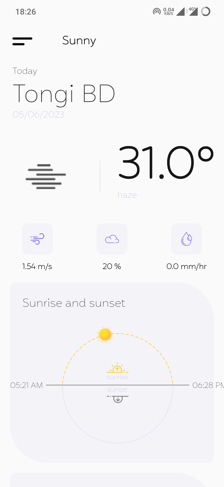
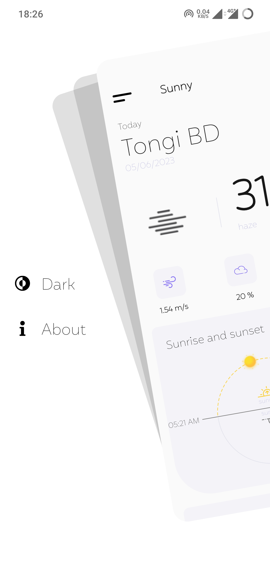
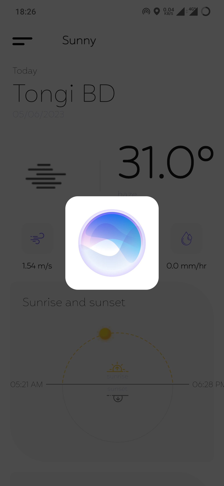
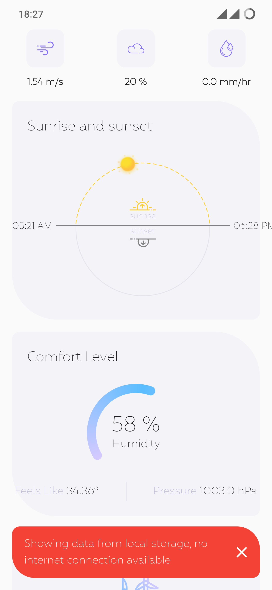

# Weather App
**Creator:**  A.F.M. MOHIMENUL JOAA\
**Description:**  New sample weather flutter project.\
**Supported Platform:** Android, iOS, Web\
**UI/UX Link:**  [Weather app UI/UX][UI]

## Features
- Material design
- Clean architecture using [Business Logic Component][BLC]
- Local data caching using [hive][H]
- Network image caching using [Cached Network Image][CNI] 
- Inherited Widget using [provider][PV]
- App Routing
- Repository Pattern
- Flare animation using [Flare Flutter][PV]
- Proper Error Handling
- Proper Permission Handling
- Pull to refresh

## Screenshot

  
  
  
  

## Build Requirements
| SDK     | Version          |
|---------|------------------|
| Dart    | [2.18][DART-218] |
| Flutter | [3.30][FLU-330]  |

## Dependency

| Dev Dependencies             |
|------------------------------|
| [cupertino_icons][CI]        |
| [flutter_svg][FSVG]          |
| [sleek_circular_slider][SCS] |
| [r_dotted_line_border][RDL]  |
| [flutter_zoom_drawer][FZD]   |
| [logging][LG]                |
| [freezed_annotation][FA]     |
| [json_annotation][JA]        |
| [bloc][BLC]                  |
| [flutter_bloc][FBLC]         |
| [provider][PV]               |
| [flare_flutter][PV]          |
| [dio][D]                     |
| [hive][H]                    |
| [intl][INTL]                 |
| [dartz][DTZ]                 |
| [get_it][GT]                 |
| [cached_network_image][CNI]  |
| [flutter_cache_manager][FCM] |
| [path_provider][PP]          |
| [geolocator][GL]             |
| [shimmer][SS]                |

## License
MIT License

[UI]: <https://xd.adobe.com/view/7fd066d5-4767-4148-8fe9-cac42480a635-2a83/grid/>
[CI]: <https://pub.dev/packages/cupertino_icons>
[FSVG]: <https://pub.dev/packages/flutter_svg>
[SCS]: <https://pub.dev/packages/sleek_circular_slider>
[RDL]: <https://pub.dev/packages/r_dotted_line_border>
[FZD]: <https://pub.dev/packages/flutter_zoom_drawer>
[FA]: <https://pub.dev/packages/freezed_annotation>
[LG]: <https://pub.dev/packages/logging>
[BLC]: <https://pub.dev/packages/bloc>
[FBLC]: <https://pub.dev/packages/flutter_bloc>
[PV]: <https://pub.dev/packages/provider>
[FF]: <https://pub.dev/packages/flare_flutter>
[D]: <https://pub.dev/packages/dio>
[H]: <https://pub.dev/packages/hive>
[INTL]: <https://pub.dev/packages/intl>
[DTZ]: <https://pub.dev/packages/dartz>
[GT]: <https://pub.dev/packages/get_it>
[CNI]: <https://pub.dev/packages/cached_network_image>
[FCM]: <https://pub.dev/packages/flutter_cache_manager>
[PP]: <https://pub.dev/packages/path_provider>
[GL]: <https://pub.dev/packages/geolocator>
[SS]: <https://pub.dev/packages/shimmer>
[JA]: <https://pub.dev/packages/json_annotation>
[DART-218]: <https://dart.dev/guides/language/evolution#dart-218>
[FLU-330]: <https://docs.flutter.dev/release/release-notes/release-notes-3.3.0>